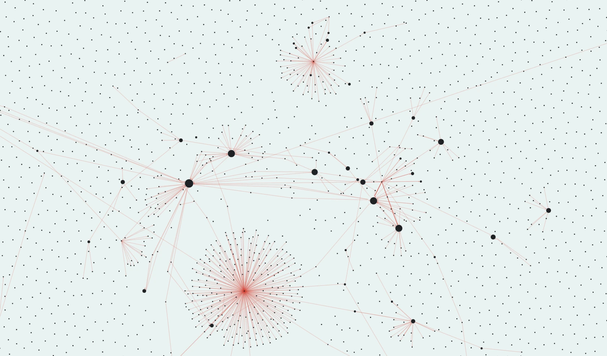
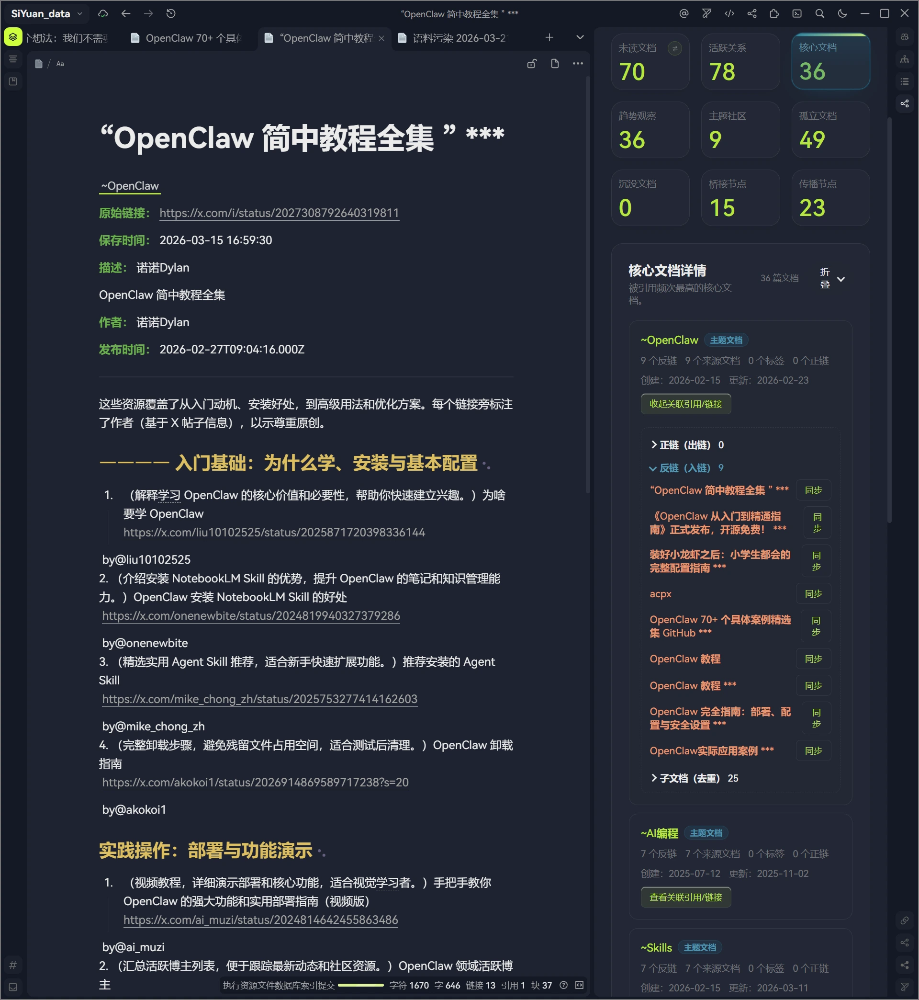

# 一个想法：我们不需要更酷炫的关系图，我们需要一个能给出建议的仪表盘

## 楔子

作为一个“松鼠症”患者，我在思源笔记里已经贮藏超过1万篇笔记，少部分是输出内容，大部分是从微信公众号、头条号、网站剪藏的内容。

自从学习了著名的卡片笔记法，我就寄希望于能从笔记网络中产生链接和洞见，促进学习和输出。但在这样的体量下，思源笔记（或其他以双链为卖点的笔记软件）现有的链接管理功能对我实际帮助不大，点开“关系图”除了看到一大堆笔记节点喷薄而出的视觉愉悦感，我根本做不了什么，既无法从中产生洞见，也无从下手进一步维护笔记链接。

主要问题是笔记规模扩大后图谱变得十分混乱，图谱节点重叠、布局每次加载变化，导致难以分析和导航。关系图仅显示连接存在，却不揭示具体关系类型（如因果或包含），信息密度低，无法提供层级笔记那样的清晰结构。

## 我们真正需要的是什么？

所以，我们真正需要的是什么？是在现有关系图上叠加“关系类型”，还是提供一个视觉上更友好更酷炫的关系图？

给链接加“关系类型”，例如把链接标成 supporting、opposing、extends 之类，这样软件就能按关系分组 backlinks，也能让图谱按关系类型标注或筛选。但这会让链接体系迅速膨胀，很多非正式、非学术笔记难以稳定分类，最后可能仅仅是增加维护负担和用户压力，还是用不起来。

同样，现有关系图的问题不在于图不够炫，而在于它没有回答“我现在该做什么”。 现有图谱最常见的实际用途，本来就不是洞见生成，而是找孤儿笔记、做局部过滤、看哪些节点更大或更重要，这天然更像诊断面板，而不是主工作台。

于是，我有一个想法：也许我们不需要一个更复杂强大的关系图，也不需要一个更酷炫的关系图，我们需要一个能给出建议的仪表盘。

为此，我尝试构建了一个插件——“脉络镜”（暂定名）——希望让隐没的知识，重现脉络。

‍
