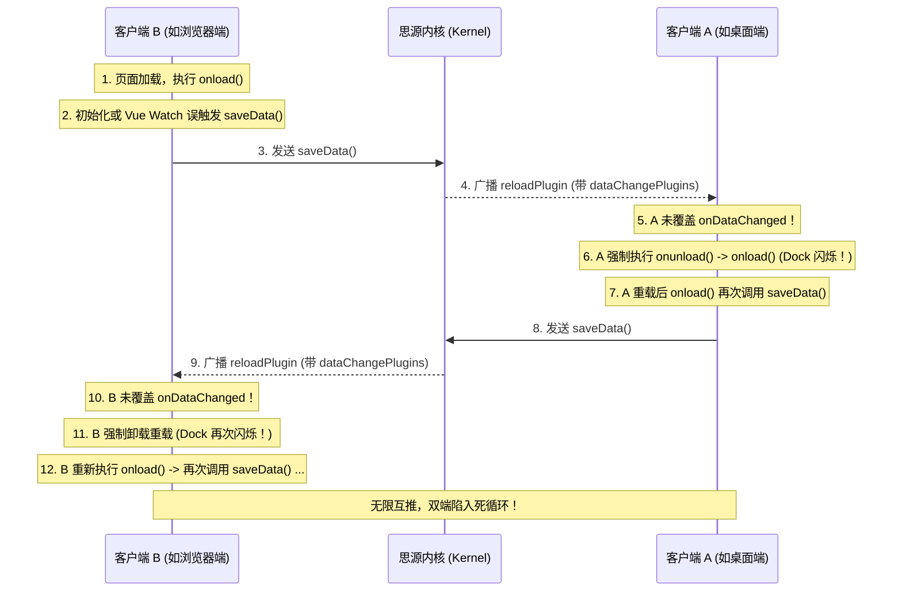

# 插件多端同步与数据持久化防重启指南

- 适用版本：SiYuan `v3.0.0`+ / `v3.8.5`+ / npm `siyuan@1.2.8`+
- 最后核对：2026-10-02
- 稳定性：stable
- 官方规范参考：`siyuan-note/siyuan@app/src/plugin/index.ts`、`app/src/plugin/loader.ts`

---

## 1. 现象与典型症状

在开发或使用思源笔记插件时，常常遇到以下诡异现象：
- **单端正常**：在桌面端单独运行良好，没有任何异常；
- **多端闪烁**：一旦在浏览器中打开思源（如 `http://127.0.0.1:8433/`），或者桌面端开启了多窗口、多设备同时连接同一内核时，**插件的 Dock 图标开始高频闪烁（每隔数百毫秒甚至数十毫秒被销毁又重新创建）**；
- **网络风暴**：浏览器或桌面端开发者工具 Network 面板中，反复涌现大量的 `/api/file/putFile` 与 `/api/plugin/reloadPlugin` 请求；
- **控制台重载**：控制台连续打印插件初始化日志，表明插件在不断经历 `onunload() -> onload()` 的死循环。

该问题不仅会导致 Dock 图标剧烈抽搐、用户输入焦点丢失、面板被频繁重置，更会导致内存泄漏与严重的性能损耗。

---

## 2. 思源内核机制与根因剖析

### 2.1 思源内核的多端存储变更广播
思源笔记内核对插件的私有数据存储目录（`/data/storage/petal/<plugin-name>/`）做变更追踪。
当任意一个客户端（例如浏览器端）调用 `this.saveData(name, data)` 时：
1. 内核将数据落盘到存储文件；
2. 内核通过 WebSocket 向**除当前发起端之外的其他所有客户端**广播 `reloadPlugin` 消息，其 payload 携带 `dataChangePlugins: ["<plugin-name>"]`。

### 2.2 思源前端的降级全量重载判定
客户端在收到 `reloadPlugin` 消息后，并不是无条件整插件重启，而是依据插件是否具备增量响应能力进行判定。

官方前端源码依据（`app/src/plugin/index.ts`）：
```ts
export const shouldReloadOnDataChange = (plugin: Plugin) => {
    return plugin.onDataChanged === Plugin.prototype.onDataChanged;
};
```
官方前端装载器依据（`app/src/plugin/loader.ts`）：
```ts
if (shouldReloadOnDataChange(plugin)) {
    // 强制卸载并重载整个插件！
    destroyAllDocks(plugin);
    plugin.onunload();
    ...
    await plugin.onload();
} else {
    // 增量静默通知插件自身处理
    plugin.onDataChanged();
}
```

- **若插件未覆盖 `onDataChanged`**：思源判定该插件无法自行处理存储变动，**强制将插件彻底卸载重载**，直接执行 `destroyAllDocks` 销毁 Dock 图标，并重新执行 `onload()` 挂载新图标，导致视觉上的闪烁。
- **若插件覆盖了 `onDataChanged`**：思源只调用 `plugin.onDataChanged()`，保留现有的 Dock、DOM 节点和运行时状态，界面完全静默平稳。

### 2.3 Ping-Pong 重启死循环（无限互推风暴）
闪烁之所以演变成“持续不断”的死循环，是因为构成了闭环链路：



---

## 3. 防范设计模式（四大黄金法则）

### 法则一：务必在插件主类中覆盖 `onDataChanged()`
所有使用 `saveData` / `loadData` 的插件，**必须在插件主类中显式实现 `async onDataChanged()` 钩子**。

#### 规范要求
1. 在 `onDataChanged()` 中仅做内存状态或组件的**静默增量刷新**（如调用 `loadSettings()` 重新从存储读入配置）；
2. **严禁在 `onDataChanged()` 内部再次调用 `saveData()`**；
3. 不再销毁 Dock，不再触动外部 DOM 树。

```ts
export default class MyPlugin extends Plugin {
  /**
   * 覆盖基类 onDataChanged 钩子。
   * 当其他端或外部改动了插件私有存储时，思源通过 WebSocket 广播数据变更。
   * 显式实现该方法可阻止思源内核降级为全量卸载重载，彻底消除 Dock 闪烁与多端无限重启。
   */
  async onDataChanged() {
    await this.loadSettings()
    // 若有模板、Schema、自定义列表等数据，同样仅作静默读取刷新
    await this.reloadOtherDataSilently()
  }
}
```

---

### 法则二：初始加载期（`onload`）禁止无条件写回存储
#### 常见误区
许多插件为了“确保配置存在默认字段”，在 `onload()` 中写出如下代码：
```ts
// ❌ 危险写法：每次加载都写回存储
async onload() {
  const data = await this.loadData('config.json')
  this.config = { ...DEFAULT_CONFIG, ...data }
  await this.saveData('config.json', this.config) // 每次打开页面都必定触发一次广播！
}
```

#### 正确做法
只读加载。仅当发生**真正的数据版本迁移**（如老格式升级）、或**检测到有全新的必填字段必须持久化补齐**时，才执行落盘；否则纯内存补齐默认值即可：
```ts
// ✅ 安全写法：仅在发生实质性变更时才写入
async onload() {
  const data = await this.loadData('config.json')
  let needPersist = false
  if (!data) {
    needPersist = true // 首次初始化
  } else if (data.version < CURRENT_VERSION) {
    needPersist = true // 版本升级迁移
  }

  this.config = { ...DEFAULT_CONFIG, ...(data || {}) }
  if (needPersist) {
    await this.saveData('config.json', this.config)
  }
}
```

---

### 法则三：基于规范化字典序的持久化幂等校验（Last-Saved Hash）
Vue 响应式对象、Object.assign 或解构赋值会导致对象的 Key 顺序发生变化，直接使用 `JSON.stringify(a) === JSON.stringify(b)` 可能因为键的排列顺序不同而产生“伪变更”，导致 watch 频繁被触发。

#### 规范化序列化工具
```ts
export function serializeConfig(config: Record<string, any>): string {
  const sorted: Record<string, any> = {}
  for (const key of Object.keys(config).sort()) {
    sorted[key] = config[key]
  }
  return JSON.stringify(sorted)
}
```

#### 幂等写入状态管理
维护一个 `lastSavedConfigJson` 字段。每次保存前比对，**若内容完全一致则直接跳过 `saveData`**：
```ts
private lastSavedConfigJson = ''

async saveSettings(nextSettings: PluginConfig) {
  const nextJson = serializeConfig(nextSettings)
  if (nextJson === this.lastSavedConfigJson) {
    return // 内容无实质变化，坚决不向内核写回
  }
  this.lastSavedConfigJson = nextJson
  await this.saveData('settings.json', nextSettings)
}
```

---

### 法则四：防范响应式 Watcher 的“初始赋值延迟回写”陷阱
在使用 Vue 3 的 Composable 或组件状态管理时，常常使用深层监听实现“自动保存”：
```ts
// ❌ 隐蔽陷阱
const state = ref([])

// 模块顶层声明了 watcher
watch(state, () => {
  triggerDebouncedSave() // 防抖 300ms 后调用 saveData
}, { deep: true })

export async function initState(plugin: Plugin) {
  const data = await plugin.loadData('state.json')
  state.value = data // ⚠️ 此时赋值立即触发了 watch！300ms 后必定发出一次 saveData！
}
```

#### 解决手段
1. **初始快照同步**：在 `initState` 赋初值后，立即将当前序列化值记录为 `lastSavedJson`；
2. **防抖执行处卡口**：在防抖定时器触发的 `saveAllData` 内部，比对当前序列化与 `lastSavedJson`，相等则直接退出；
3. **加载中标记**：使用 `isInitializing` 标志位，在初始加载期间跳过 watcher 回调。

```ts
// ✅ 安全的 Composable 自动保存模式
let lastSavedJson = ''

export async function initState(plugin: Plugin) {
  const data = await plugin.loadData('state.json')
  if (data) {
    state.value = data
  }
  // 记录初始基准快照，抵消赋初值带来的 watcher 触发
  lastSavedJson = serializeData(state.value)
}

async function saveAllData() {
  const nextJson = serializeData(state.value)
  if (nextJson === lastSavedJson) {
    return // 抵消初始赋值或无实质变更的保存
  }
  lastSavedJson = nextJson
  await currentPlugin.saveData('state.json', state.value)
}
```

---

## 4. 标准代码模板（插件主入口）

以下是一份具备完全免疫多端重启闪烁的插件主入口标准模版：

```ts
import { Plugin } from 'siyuan'

export interface MyPluginConfig {
  version: number
  theme: string
  enabled: boolean
}

export const DEFAULT_CONFIG: MyPluginConfig = {
  version: 1,
  theme: 'auto',
  enabled: true,
}

function serializeConfig(config: Record<string, any>): string {
  const sorted: Record<string, any> = {}
  for (const key of Object.keys(config).sort()) {
    sorted[key] = config[key]
  }
  return JSON.stringify(sorted)
}

export default class MyPlugin extends Plugin {
  private config: MyPluginConfig = { ...DEFAULT_CONFIG }
  private lastSavedConfigJson = ''

  async onload() {
    await this.loadSettings()
    // 挂载 Dock、快捷栏、菜单等...
  }

  onunload() {
    // 卸载清理...
  }

  /**
   * 1. 覆盖 onDataChanged，防止思源降级全量重载
   */
  async onDataChanged() {
    await this.loadSettings()
  }

  /**
   * 2. 加载配置（静默更新内存状态与快照）
   */
  async loadSettings() {
    try {
      const stored = await this.loadData('settings.json')
      const merged = { ...DEFAULT_CONFIG, ...(stored || {}) }
      this.config = merged
      this.lastSavedConfigJson = serializeConfig(merged)
    } catch {
      this.config = { ...DEFAULT_CONFIG }
      this.lastSavedConfigJson = serializeConfig(this.config)
    }
  }

  /**
   * 3. 幂等保存配置（去重防抖）
   */
  async saveSettings(nextSettings: Partial<MyPluginConfig>) {
    const updated = { ...this.config, ...nextSettings }
    const nextJson = serializeConfig(updated)
    
    // 内容未变直接短路，不发起保存
    if (nextJson === this.lastSavedConfigJson) {
      return
    }

    this.config = updated
    this.lastSavedConfigJson = nextJson
    await this.saveData('settings.json', this.config)
  }
}
```

---

## 5. 调试与排查清单（Checklist）

遇到插件在多端/浏览器打开时闪烁或不断重启，按以下步骤依次排查：

- [ ] **检查 1**：插件主类是否已声明 `async onDataChanged()`？（若未声明，思源一定会全量重启整插件）；
- [ ] **检查 2**：全局搜索 `saveData(`，检查是否有在 `onload()` 或数据初始化函数中无条件调用的地方？
- [ ] **检查 3**：全局搜索 `watch(`，检查是否有对持久化状态的深度监听？在加载初值时是否会触发 300ms 后的防抖写回？
- [ ] **检查 4**：保存前是否进行了基于字典序排序的 `JSON.stringify` 幂等校验？
- [ ] **检查 5**：如果接入了第三方配置接管（如 `siyuan-api-switch`），在接管回调触发更新时，是否错误地把接管配置写回了本地持久化？
- [ ] **检查 6**：在 `onDataChanged()` 中是否只有“读”而没有任何“写”？
